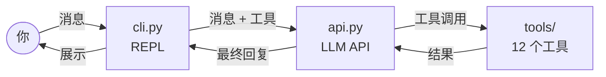

<p align="center">
  
</p>

<p align="center">
  <strong>你的迷你编程爪</strong><br>
  <em>用约 2000 行 Python 学习如何构建 AI 编程智能体</em>
</p>

<p align="center">
  <a href="https://pypi.org/project/miniclaw/"></a>
  <a href="https://pypi.org/project/miniclaw/"></a>
  <a href="LICENSE"></a>
</p>

<p align="center">
  <a href="README.md">English</a> | 中文
</p>

---

## miniclaw 是什么？

你是否好奇像 [Claude Code](https://docs.anthropic.com/en/docs/agents-and-tools/claude-code/overview) 或 [OpenClaw](https://github.com/openclaw/openclaw) 这样的工具底层是如何运作的？**miniclaw** 就是答案 —— 一个极简、可 hack 的 AI 编程智能体，你用一个下午就能通读全部代码。

名字说明了一切：**mini** + **claw**（来自 Open**Claw**）。没有庞大的架构，没有上千个文件的单体仓库。只有驱动每个 AI 编程助手所必需的核心循环：

```
你输入一个请求
  -> LLM 进行思考
    -> LLM 调用工具（read / write / edit / grep / glob / bash / todo_write / ask_followup_question）
      -> 工具在你的工作区中执行
        -> LLM 看到执行结果
          -> 重复以上过程，直到完成
```

如果你想**学习**、**教学**或**折腾** AI 智能体，从这里开始。

## 功能特性

- **12 个工具** —— `read`、`write`、`edit`、`glob`、`grep`、`bash`、`Skill`、`todo_write`、`ask_followup_question`、`memory`、`session_search`、`Agent`。工作区文件操作，外加任务追踪、用户澄清、按需加载的技能、持久化记忆、历史会话回溯和子智能体。
- **项目规则** —— 自动加载工作区的 `AGENTS.md` 和 `.miniclaw/rules/*.md` 到系统提示中。项目规范和编码指南始终对智能体可见。
- **Plan 模式** —— 智能体可进入只读规划阶段：探索代码、生成结构化计划，只有在你批准后才开始执行。写操作在你说"开始"之前会被阻止。
- **技能系统** —— 在 `.miniclaw/skills/<名称>/` 下放入一个 `SKILL.md`，智能体就能学会新技能。技能会自动注入到系统提示中；`Skill` 工具按需加载完整指令。
- **记忆系统** —— 持久化信息存储在 `~/.miniclaw/memory/MEMORY.md` 中，每个会话自动注入。智能体可以读写主题文件来记录更长的笔记。
- **会话搜索** —— 对话记录在本地保存；智能体可以浏览、全文搜索或滚动查看历史会话。
- **子智能体** —— 可选的 `Agent` 工具会启动一个隔离的子智能体（`explore` / `general`），让调研或辅助任务不会污染主上下文。通过 `subagent.enabled` 启用。
- **上下文管理** —— 微压缩和自动摘要功能让长对话保持在上下文窗口内。
- **任意兼容 OpenAI 的 LLM** —— 只需修改一个环境变量即可切换模型。默认：DeepSeek V4 Pro（通过腾讯云 TokenHub）。
- **工作区隔离** —— 所有文件操作被限制在工作区目录内，无法通过 `..` 路径逃逸。

## 快速开始

**安装：**

```bash
pip install miniclaw
```

**运行：**

```bash
export LLM_API_KEY=你的_API_密钥
cd ~/我的项目
miniclaw
```

就这样。你正在和一个可以读取、编写和运行代码的 AI 智能体对话。

<details>
<summary>其他安装方式</summary>

**pipx（推荐，环境隔离）：**

```bash
pip install pipx
pipx ensurepath
pipx install miniclaw
```

**从源码安装（用于开发）：**

```bash
git clone https://github.com/sundl123/miniclaw.git
cd miniclaw
pip install -e .
```

</details>

> **提示：** 如果安装后出现 `command not found: miniclaw`，说明你的 Python 脚本目录不在 PATH 中。运行 `pipx ensurepath`（pipx）或将 `~/.local/bin` 添加到 PATH（pip）。

## 工作原理

整个智能体只包含少数几个 Python 模块。以下是核心循环：



每个模块职责单一 —— 建议按以下顺序阅读：

| 模块                                        | 功能                                                             |
| ------------------------------------------- | ---------------------------------------------------------------- |
| [`cli.py`](miniclaw/cli.py)                 | 命令行 REPL，解析输入，处理 `/plan`、`/clear` 等命令             |
| [`api.py`](miniclaw/api.py)                 | 向 LLM 发送消息，运行工具调用循环，直到模型停止调用工具          |
| [`tools/`](miniclaw/tools/)                 | 工作区工具 + `Skill`、`todo_write`、`ask_followup_question`、`memory`、`session_search`、`Agent` 的调度 |
| [`rules.py`](miniclaw/rules.py)             | 自动加载 `AGENTS.md` 和 `.miniclaw/rules/*.md` 到系统提示           |
| [`context/`](miniclaw/context/)             | 微压缩、自动摘要、上下文窗口管理                                 |
| [`memory/`](miniclaw/memory/)               | 持久化记忆存储和 `memory` 工具                                   |
| [`sessions/`](miniclaw/sessions/)           | 会话数据库、事件记录和 `session_search` 工具                     |
| [`subagent/`](miniclaw/subagent/)           | 子智能体运行器和 `Agent` 工具                                    |
| [`plan_mode.py`](miniclaw/plan_mode.py)     | Plan 模式的权限守卫：允许只读操作，阻止写操作                    |
| [`skills.py`](miniclaw/skills.py)           | 扫描 `.miniclaw/skills/` 并将技能元数据注入系统提示              |
| [`settings.py`](miniclaw/settings.py)       | 加载并合并全局和工作区级别的 JSON 配置                           |
| [`dirs.py`](miniclaw/dirs.py)               | 解析用户级（`~/.miniclaw/`）和工作区级路径                       |
| [`config.py`](miniclaw/config.py)           | 路径安全检查与 API 常量                                          |
| [`ui.py`](miniclaw/ui.py)                   | 终端 UI：启动横幅、彩色输出（基于 rich）                         |
| [`dev_logging.py`](miniclaw/dev_logging.py) | 开发者日志，输出到 `~/.miniclaw/logs/`                           |

## 命令

| 命令                 | 描述                         |
| -------------------- | ---------------------------- |
| `/plan`              | 进入 Plan 模式（只读探索）   |
| `/plan <描述>`       | 进入 Plan 模式并附带任务描述 |
| `/clear`             | 清除对话历史                 |
| `/model`             | 显示当前模型                 |
| `/quit` `/exit` `/q` | 退出                         |

**快捷键：** `Ctrl+J` 换行，`Up/Down` 浏览历史，`Ctrl+C` 取消，`Ctrl+D` 退出。

## 配置

配置使用 JSON 格式，分为两层：全局（`~/.miniclaw/config.json`）和工作区（`{workspace}/.miniclaw/config.json`）。工作区配置优先级更高。

运行 `miniclaw init` 创建默认配置。使用 `miniclaw init --force` 重置。

```json
{
  "llm": {
    "api_key": "你的_API_密钥",
    "model": "deepseek-V4-pro",
    "base_url": "https://tokenhub.tencentmaas.com/v1",
    "timeout": 300
  },
  "plan_mode": {
    "allowed_bash_patterns": ["^curl\\s+-s"]
  },
  "memory": {
    "enabled": true
  },
  "sessions": {
    "enabled": true
  },
  "subagent": {
    "enabled": false,
    "max_turns": 300
  }
}
```

所有 `llm` 字段均可通过环境变量覆盖（环境变量优先级最高）：

| 变量                 | 描述                                                     |
| -------------------- | -------------------------------------------------------- |
| `LLM_API_KEY`        | LLM API 密钥                                             |
| `LLM_MODEL`          | 模型名称（默认：`deepseek-V4-pro`）                       |
| `LLM_BASE_URL`       | 兼容 OpenAI 的 API 基础 URL（默认：TokenHub）              |
| `LLM_HTTP_TIMEOUT`   | HTTP 超时时间（秒，默认：300）                           |
| `MINICLAW_WORKSPACE` | 工作区目录（也可通过 `-w` 参数指定；CLI 参数优先级最高） |

## 技能系统

在 `.miniclaw/skills/<技能名称>/SKILL.md` 中创建文件，包含 YAML 前置元数据（`name`、`description`）和指令正文。智能体在启动时看到技能列表，并按需读取完整的 SKILL.md。

## 规则系统

在工作区根目录放置 `AGENTS.md` 或在 `.miniclaw/rules/` 下放入 `.md` 文件 —— 它们会被自动注入到系统提示中，智能体始终能看见你的项目规范。支持多个规则文件：

```
workspace/
├── AGENTS.md                     # 项目顶层规则
└── .miniclaw/
    └── rules/
        ├── style.md              # 编码风格指南
        └── security.md           # 安全约束
```

## 文件布局

```
~/.miniclaw/                    # 用户级（跨工作区共享）
├── logs/                       # 运行时日志
├── memory/                     # 持久化记忆（MEMORY.md + 主题文件）
├── sessions/                   # 会话数据库（SQLite + FTS）
└── config.json                 # 全局配置（可选）

{workspace}/.miniclaw/          # 工作区级（每个项目独立）
├── config.json                 # 工作区配置（优先级更高）
├── todos.json                  # 当前任务列表（由 todo_write 管理）
├── plans/                      # Plan 文件
├── rules/                      # 项目级规则 .md 文件
└── skills/                     # 技能目录
```

## 项目结构

```
miniclaw/
├── chat.py              # 开发入口（等同于 `miniclaw` 命令）
├── pyproject.toml       # 包配置
├── CHANGELOG.md         # 发布历史
├── miniclaw/            # Python 包
│   ├── cli.py           # REPL
│   ├── api.py           # LLM API + 工具循环
│   ├── rules.py         # 自动加载 AGENTS.md + .miniclaw/rules/*.md
│   ├── tools/           # 工具实现 + 调度
│   │   ├── ask.py       # ask_followup_question 工具
│   │   └── todo_write.py # todo_write 工具
│   ├── context/         # 上下文压缩 + 摘要
│   ├── memory/          # 持久化记忆工具
│   ├── sessions/        # 会话记录 + 搜索
│   ├── subagent/        # 子智能体运行器 + Agent 工具
│   ├── plan_mode.py     # Plan 模式权限
│   ├── config.py        # 路径安全 + 常量
│   ├── dirs.py          # 目录解析
│   ├── settings.py      # 配置加载 + 合并
│   ├── skills.py        # 技能扫描 + 系统提示构建
│   ├── ui.py            # 终端 UI（rich）
│   └── dev_logging.py   # 开发者日志
├── tests/               # 单元测试
└── docs/design/         # 设计文档
```

## 更新日志

详见 [CHANGELOG.md](CHANGELOG.md) 了解发布历史。

## 设计文档

| 文档                                                      | 描述                                                                                   |
| --------------------------------------------------------- | -------------------------------------------------------------------------------------- |
| [架构分析](docs/design/miniclaw-architecture-analysis.md) | 从 Agent Loop、Skill 机制、Tool 设计、Prompt Cache、Plan Mode 五个维度深入分析项目架构 |
| [Sub-agent](docs/design/subagent.md)                      | Sub-agent（`Agent` tool）设计与实现说明                                                |

## 运行测试

```bash
python3 -m pytest tests/ -v
```

## 贡献

miniclaw 旨在保持小巧和可读性。欢迎保持简洁的 PR。

## 许可证

[MIT](LICENSE)