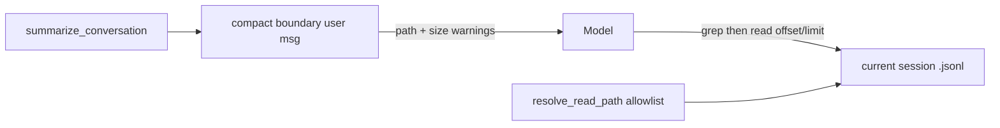

# Compact 后开放当前 records JSONL（read/grep）

## 目标

Compact 成功后，模型能通过 `read`/`grep` 访问**当前会话** transcript（`~/.miniclaw/records/{date}_{session_id}.jsonl`），并在提示中明确：文件大、单行（尤其 tool 输出）也可能很大，禁止整文件通读。

## 既定决策

- 白名单：**仅当前 session 的那一个 jsonl 文件**（精确路径匹配），不是整个 `records/` 目录
- 工具：`read` + `grep` 共用该白名单；`write`/`edit`/`glob` 不变
- 不改 `session_search` 的 current-session 排除逻辑
- 不新增第二份 precompact dump（主 JSONL 已是完整 append-only 记录）

## 实现要点

### 1. 暴露当前 transcript 路径

[`miniclaw/sessions/records.py`](miniclaw/sessions/records.py)：为 `RecordsWriter` 增加公开属性 `jsonl_path`（现有 `_jsonl_path`）。

[`miniclaw/cli.py`](miniclaw/cli.py)：初始化 context 时写入：

- `context["records_jsonl_path"] = records_writer.jsonl_path`
- 已有 `session_id` 可复用

### 2. 路径白名单（精确文件）

[`miniclaw/config.py`](miniclaw/config.py)：扩展 `is_allowed_read_path` / `resolve_read_path` / `resolve_glob_pattern` 签名，增加 `allowed_read_files: frozenset[str] = frozenset()`：

- 若 `os.path.normpath(abs_path)` 等于集合中某一项 → 允许
- 同目录其他 jsonl / `state.db` / `memory/` 仍拒绝

[`miniclaw/tools.py`](miniclaw/tools.py)：

- helper `_allowed_read_files(context)`：有 `records_jsonl_path` 则返回 `frozenset({normpath})`，否则空
- `handle_read` / `handle_grep`（及内部已走 `resolve_read_path` 的路径）传入该集合
- **不**改 `handle_write` / `handle_edit`（仍只用 `resolve_path`）
- 轻量更新 `read`/`grep` schema description：提及 compact 后可对 boundary 给出的 session transcript 路径做定点检索；大文件须 offset/limit

### 3. Compact boundary 注入指针

[`miniclaw/context/summarize.py`](miniclaw/context/summarize.py) 的 `_rebuild_messages` / `summarize_conversation` 增加可选参数 `transcript_path`、`session_id`。边界文案在现有 Summary 段落后追加（英文，与现有 boundary 一致），大意：

- Full transcript 绝对路径 + `session_id`
- 文件可能很大；JSONL 一行一事，单行（尤其 tool）也可能很大
- 需要细节时先 `grep` 关键词，再 `read` 小窗口（小 `limit`）；禁止整文件读取

[`miniclaw/context/manage.py`](miniclaw/context/manage.py)：`_try_auto_summarize` / `manual_compact` 从 `context` 取 `records_jsonl_path` / `session_id` 传给 `summarize_conversation`。无 records 时行为与今天一致（不写路径段）。

### 4. 测试

- [`tests/test_tools.py`](tests/test_tools.py)：当前 session jsonl 可 `resolve_read_path` / `read` / `grep`；同目录另一文件拒绝；workspace 行为不变
- [`tests/test_summarize.py`](tests/test_summarize.py)：带 `transcript_path` 时 boundary 含路径与「large / offset-limit / grep」类提示；不带时与旧文案兼容

### 5. 文档

[`docs/design/agent-memory.md`](docs/design/agent-memory.md)：把 Phase 2c「compact 后内容找回」标为通过当前 session JSONL 的 read/grep 完成（一句即可）。

## 明确不做

- 不开放整个 `~/.miniclaw/records/`
- 不改 `session_search` exclusion
- 不改 micro-compact / records 写入格式 / `records_max_event_bytes`
- 不为 bash 增加额外沙箱（bash 本就可读任意路径；本需求走正规 read/grep）
