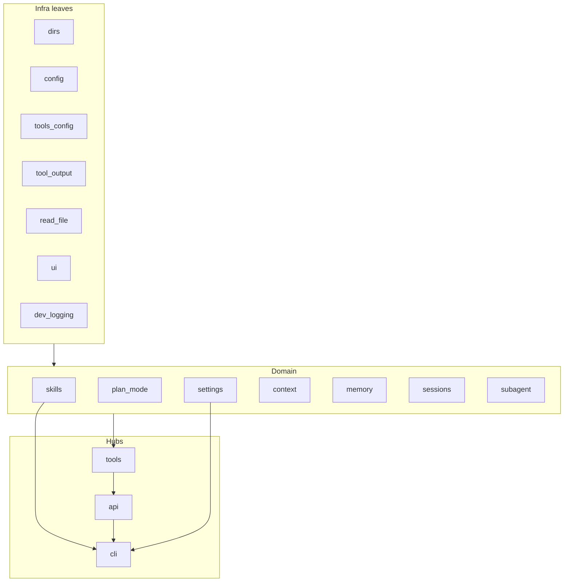

# miniclaw 根模块拆包评估

## 现状

根包 `miniclaw/` 已呈「扁平基础设施 + 领域子包」结构：

```
miniclaw/
├── dirs / config / settings / ui / …   # 根层扁平文件 (~2.4k LOC)
├── tools.py (531) api.py (383) cli.py (282) …
├── context/   (~937)   # 已拆
├── memory/    (~920)   # 已拆
├── sessions/  (~1026)  # 已拆
└── subagent/  (~334)   # 已拆
```

已有子包模式清晰：`config.py` + 领域逻辑 + 可选 `tool.py`，由根层 [`tools.py`](miniclaw/tools.py) / [`settings.py`](miniclaw/settings.py) / [`cli.py`](miniclaw/cli.py) 装配。

依赖大体是单向分层（循环处已用 lazy import）：



---

## 结论（先说）

**没有必要把根目录文件一律拆进子包。** 全量拆包会抬高跳转成本、打乱 import，收益有限。

真正值得动的是：**`tools.py` 已是 hub，且与 `memory/` / `sessions/` / `subagent/` 的组织方式不一致**——后三者各自持有 schema+handler，核心七件套却堆在一个 531 行文件里。

其余根文件要么是共享 leaf（应保持扁平），要么是装配入口（本来就该 import 很多东西）。

---

## 逐模块建议

| 模块 | LOC | 建议 | 理由 |
|------|-----|------|------|
| [`tools.py`](miniclaw/tools.py) | 531 | **拆成 `tools/` 子包** | 最大 hub：handlers + dispatch + 内联 schema + UI 打印；已手动挂接 memory/session_search/Agent |
| [`plan_mode.py`](miniclaw/plan_mode.py) | 248 | **暂留根层**；若继续膨胀再变 `plan_mode/` | 职责内聚（白名单 + enter/exit + schema），可被 explore 复用；不必硬塞进 tools |
| [`skills.py`](miniclaw/skills.py) | 176 | **暂留**；明显增长后再变 `skills/` | 边界清晰，但体量尚可；与 memory 模式类似但未到拆包门槛 |
| [`api.py`](miniclaw/api.py) | 383 | **暂留** | streaming + agent loop 混在一起，但循环边界清楚；有 lazy import 约束，急拆易放大环 |
| [`cli.py`](miniclaw/cli.py) | 282 | **暂留** | composition root，import 多是正常的 |
| [`settings.py`](miniclaw/settings.py) | 288 | **暂留** | 配置合并门面，挂各子包 `*.config`；不要并入 `config.py` |
| [`config.py`](miniclaw/config.py) | 113 | **暂留**（日后可改名澄清） | 路径安全 + DEFAULT_*；被广泛 import，不适合下沉到某领域包 |
| [`dirs.py`](miniclaw/dirs.py) / [`dev_logging.py`](miniclaw/dev_logging.py) / [`ui.py`](miniclaw/ui.py) / [`read_file.py`](miniclaw/read_file.py) / [`tool_output.py`](miniclaw/tool_output.py) / [`tools_config.py`](miniclaw/tools_config.py) | 小 | **保持扁平** | 共享基础设施；`tools_config` 随 `tools/` 拆包时可一并迁入 `tools/config.py` |

---

## 推荐落地路径（确认后再写代码）

### 唯一优先动作：`tools.py` → `tools/`

对齐现有领域包风格，并保留公开 API：

```
miniclaw/tools/
  __init__.py      # 再导出 execute_tool / get_tool_schemas / handle_*
  dispatch.py      # TOOL_HANDLERS, execute_tool, explore/plan 门控
  schemas.py       # get_tool_schemas 组装器
  read.py / write.py / search.py / bash.py / skill.py
  config.py        # 从 tools_config.py 迁入（可选同 PR）
```

兼容约束（不能破）：

- `from miniclaw.tools import execute_tool, get_tool_schemas`（[`__init__.py`](miniclaw/__init__.py)、[`api.py`](miniclaw/api.py)、[`cli.py`](miniclaw/cli.py)）
- `tests/test_tools.py` 对 `handle_read/write/edit/glob/grep/bash/skill` 的直接 import
- 工具名不变（subagent Explore allowlist、`context` compact policy 按名字过滤）

**本阶段不做**：Hermes 式自动发现 / 插件注册表。miniclaw 的 flag 门控（memory / session_search / Agent）用显式列表足够；统一 handler 签名可作为后续小步，不阻塞物理拆分。

### 明确不做（现阶段）

- 不要为拆而拆 `api` / `cli` / `settings` / `dirs` / `config`
- 不要把 `plan_mode` 强行塞进 `tools/`（策略与 I/O 工具边界不同；dispatch 继续 import 即可）
- 不要把 `read_file` / `tool_output` 埋进仅 tools 可见的路径——`memory` 也在用

### 触发再拆的信号

- `skills.py` 出现独立 loader / prompt / registry 多文件，或 >300 LOC → `skills/`
- `plan_mode.py` 权限策略继续膨胀 → `plan_mode/`
- `api.py` 流式与 loop 各自显著变厚 → 再考虑 `agent/`（`client` / `stream` / `turn`）

---

## 风险与收益

**收益：** 核心工具与可选工具组织一致；改 bash/read 不必在 500+ 行 hub 里翻；新工具有明确落点。

**风险：** 主要是 import 路径与循环依赖。用 `tools/__init__.py` 再导出可把破坏面压到接近零；保持现有 lazy import（`api`↔`context`，`subagent`↔`api`）。

---

## 建议决策

采用「**只拆 tools，其余不动**」：现在隔离收益最大、迁移成本最低。`plan_mode` / `skills` 等按增长再跟进，避免一次大搬家。
