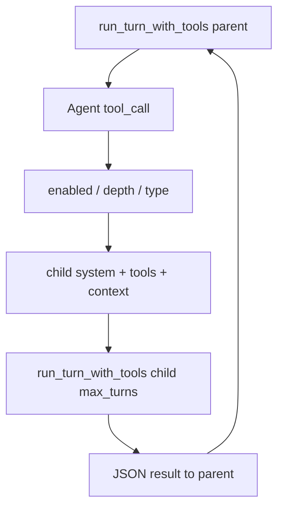

# miniclaw Sub-Agent v1 实现方案

依据已冻结设计：[docs/design/subagent.md](docs/design/subagent.md)。

## 范围

- Sync `Agent` 工具；类型 `general` / `explore`
- `subagent.enabled` 默认 `false`；支持 `MINICLAW_SUBAGENT` 环境变量覆盖（对齐 memory/sessions）
- 不做：async、fork、并行、自定义 agents、sidechain 持久化

## 数据流



## 1. 配置层

新增 [miniclaw/subagent/config.py](miniclaw/subagent/config.py)：

```python
@dataclass(frozen=True)
class SubagentConfig:
    enabled: bool = False
    max_turns: int = 30
```

在 [miniclaw/settings.py](miniclaw/settings.py) 增加 `get_subagent_config()`：合并 config 的 `subagent`；`MINICLAW_SUBAGENT` 为 `1/true/yes` 或 `0/false/no` 时覆盖 `enabled`（同 memory 模式）。

在 [miniclaw/default_config.json](miniclaw/default_config.json) 增加：

```json
"subagent": { "enabled": false, "max_turns": 30 }
```

## 2. 新包 `miniclaw/subagent/`

| 文件 | 职责 |
|------|------|
| `types.py` | `GENERAL` / `EXPLORE` 定义：`agent_type`、工具白/黑名单常量 |
| `prompt.py` | `append_worker_instructions(parent_system, agent_type)` |
| `runner.py` | `filter_tools_for_agent`、`build_child_context`、`run_subagent(...)` |
| `tool.py` | `get_agent_tool_schema()`、`handle_agent(args, workspace, context)` |

**runner 行为（写死）：**

1. `agent_depth >= 1` 或缺少 `context["llm"]` → 立即 JSON error
2. `subagent_type` 默认 `general`；非法值 error
3. child system = 父 `llm.system_prompt` + worker 段（explore 追加只读说明）
4. child tools = 过滤父 `llm.tools`：去掉 `Agent` / `memory` / `session_search`；explore 再只留 `read|grep|glob|bash|Skill`
5. child context：浅拷贝父 context；`agent_depth+=1`；`readonly_bash_only=(type==explore)`；**不**带 `records_writer`（子轨迹不写父 session）；保留 `mode` / `skill_registry` / plan 相关字段
6. 调用 `run_turn_with_tools(..., max_turns=cfg.max_turns, tools=child_tools, context=child_ctx)`
7. 返回 JSON：`status/agent_type/description/result/tool_use_count/duration_ms`；截断时 `status=truncated`

## 3. 改造现有循环与工具分发

### [miniclaw/api.py](miniclaw/api.py)

给 `run_turn_with_tools` 增加 `max_turns: int | None = None`：

- 每次进入「有 tool_calls」的迭代前 `turns += 1`
- `max_turns` 非空且 `turns > max_turns` 时：停止循环，返回当前已有 assistant 文本（caller 据此标 truncated）
- 返回值保持 `tuple[str, list[dict]]`；runner 用 messages 统计 tool 次数

### [miniclaw/tools.py](miniclaw/tools.py)

- `get_tool_schemas(..., include_agent: bool = False)`：为 true 时 append Agent schema
- `TOOL_HANDLERS["Agent"] = handle_agent`
- `execute_tool`：`Agent` 走 `handle_agent(..., context=ctx)`
- `_print_tool_invocation`：Agent 打印 `description` / `subagent_type`
- **Explore bash**：在 `execute_tool` 里，若 `ctx.get("readonly_bash_only")` 且 `name=="bash"`，用 `is_readonly_bash` + `get_plan_allowed_patterns` 拦截（与 plan mode 独立，agent mode 下 explore 仍强制只读）

### [miniclaw/cli.py](miniclaw/cli.py)

- `_init_session` 读 `get_subagent_config`；`get_tool_schemas(include_agent=subagent_cfg.enabled, ...)`
- `_repl_loop` 的 context 注入：

```python
context["llm"] = {
    "client": client,
    "model": model,
    "timeout": timeout,
    "tools": tools,
    "system_prompt": system_prompt,
    "context_config": context_config,
}
context["agent_depth"] = 0
context["subagent_config"] = subagent_cfg
```

注意：父 `tools` 列表在 session 初始化时固定；开启 flag 后主 Agent 才有 Agent schema。子循环传入已过滤列表，不再含 Agent。

### [miniclaw/ui.py](miniclaw/ui.py)

- `print_tool_call` 增加可选 `indent: int = 0`（用 `agent_depth`）
- `print_agent_start` / `print_agent_done` 两行起止日志（runner 调用）

## 4. 测试

新增 [tests/test_subagent.py](tests/test_subagent.py)，优先纯函数 + mock：

- `enabled=false` → schema 无 Agent
- `filter_tools_for_agent`：general 去掉 Agent/memory/session_search；explore 白名单
- depth>=1 → handle_agent 拒绝
- explore + 危险 bash → execute_tool 拒绝
- mock `run_turn_with_tools`：返回文本 → JSON `completed`；模拟超 max_turns → `truncated`
- plan mode 继承：child context `mode=="plan"` 仍触发 `check_plan_mode`

现有 [tests/test_api.py](tests/test_api.py) 补一条 `max_turns` 截断（mock chat_stream 连续返回 tool_calls）。

## 5. 文档与验收

- 实现完成后把 [docs/design/subagent.md](docs/design/subagent.md) 状态改为「实现中/已实现」，勾选 §9 checklist
- 手动：`MINICLAW_SUBAGENT=1 miniclaw -w <repo>`，explore 调研后确认父 messages 只有 Agent tool_result、无中间 grep

## 关键约束（避免返工）

1. **禁止** `from miniclaw.tools import execute_tool` 与 `subagent.runner` 再反向导入 tools 形成环：`handle_agent` 放在 `subagent/tool.py`，`tools.py` 只做延迟 import 或顶层 import handle_agent/schema
2. 子循环 **不要** 复用父 `records_writer`，避免子中间消息污染主 session FTS
3. `cap_tool_result` 仍作用于 Agent 返回 JSON；若 result 过长会被截断——可接受，与其他 tool 一致
